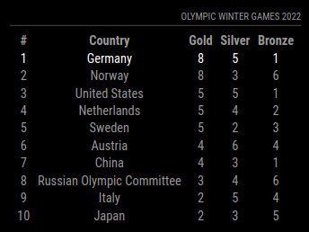

# MMM-OlympicGames [](https://raw.githubusercontent.com/fewieden/MMM-OlympicGames/master/LICENSE) [](https://travis-ci.org/fewieden/MMM-OlympicGames) [](https://codeclimate.com/github/fewieden/MMM-OlympicGames) [](https://snyk.io/test/github/fewieden/mmm-olympicgames)

Olympic Games Module for MagicMirror<sup>2</sup>

## Example



## Dependencies

* An installation of [MagicMirror<sup>2</sup>](https://github.com/MichMich/MagicMirror)
* npm
* [node-fetch](https://www.npmjs.com/package/node-fetch)
* [lodash](https://www.npmjs.com/package/lodash)

## Installation

1. Clone this repo into `~/MagicMirror/modules` directory.
1. Configure your `~/MagicMirror/config/config.js`:

    ```js
    {
        module: 'MMM-OlympicGames',
        position: 'top_right',
        config: {
            // all your config options, which are different than their default values
        }
    }
    ```

1. Run command `npm install --production` in `~/MagicMirror/modules/MMM-OlympicGames` directory.

## Global config

| **Option** | **Default** | **Description** |
| --- | --- | --- |
| `locale` | `undefined` | By default it is using your system settings. You can specify the locale in the global MagicMirror config. Possible values are for e.g.: `'en-US'` or `'de-DE'`. |

To set a global config you have to set the value in your config.js file inside the MagicMirror project.


## Config Options

| **Option** | **Default** | **Description** |
| --- | --- | --- |
| `highlight` | `false` | Which country (alpha-2 code) should be highlighted. E.g. `'DE'` for `Germany`. You can find all alpha-2 codes [here](https://en.wikipedia.org/wiki/ISO_3166-1_alpha-2).    |
| `maxRows` | `10` | How many countries should be displayed. |
| `title` | `'Olympic Winter Games 2022'` | The title above the medal table. |
| `reloadInterval` | `1800000` (30 mins) | How often should the data be fetched. |

## Developer

* `npm run lint` - Lints JS and CSS files.
