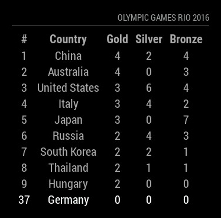

# MMM-OlympicGames
Olympic Games Module for MagicMirror<sup>2</sup>

## Example



## Dependencies
  * An installation of [MagicMirror<sup>2</sup>](https://github.com/MichMich/MagicMirror)
  * npm
  * [request](https://www.npmjs.com/package/request)

## Installation
 1. Clone this repo into `~/MagicMirror/modules` directory.
 2. Configure your `~/MagicMirror/config/config.js`:

    ```
    {
        module: 'MMM-OlympicGames',
        position: 'top_right',
        config: {
            ...
        }
    }
    ```
 3. Run command `npm install` in `~/MagicMirror/modules/MMM-OlympicGames` directory.

## Config Options
| **Option** | **Default** | **Description** |
| --- | --- | --- |
| `highlight` | `false` | Which country should be highlighted 'COUNTRYNAME'. |
| `maxRows` | `10` | How many countries should be displayed. |
| `title` | `'Olympic Games Rio 2016'` | The title above the medal table |
| `reloadInterval` | `1800000` (30 mins) | How often should the data be fetched |